# The Mechanism of `CORRECTION + CONJUNCTION` 

## Component Definition

### `CORRECTION` 
By adopting the definition by Lascarides & Asher (2009), `CORRECTION` is considered as divergent (non-veridical) subordinating rhetorical relation embedding a denial, as quoted here:

> Asher and Lascarides (2003, p363) stipulates that in the absence of divergent rhetorical relations (in other words, speech acts of denial such as *Correction* and *Counterevidence*), all the content is agreed upon.

and:

>Let 〈Π, F, last〉 be an SDRS. Furthermore, where π1, π2 ∈ Π, we say that π1 > π2 iff either: (i) R(π1, π2) is within the range of F , where R is a subordinating relation (e.g., Q-Elab, Plan-Elab, IQAP, Correction, Background, Elaboration, Explanation); or ... 

According to the same paper, the semantics of Correction is defined as 

$$(w, f) \llbracket \mathit{Correction}(\pi_1, \pi_2) \rrbracket_m (w', g) \text{ iff } (w, f) \llbracket (\neg K_{\pi_1}) \land K_{\pi_2} \land \varphi_{\mathit{Correction}(\pi_1, \pi_2)} \rrbracket_m (w', g)$$

### The two tasks of `CORRECTION`

A single `CORRECTION` token carries two distinct jobs. They are told apart **structurally**. Annotating the separator itself (e.g. `CORRECTION-intra`) would violate SBN's design philosophy, which admits only the fixed separator inventory.

| | Intra-turn self-repair | Cross-turn repair / correction |
|---|---|---|
| Structural signature | **has** a sibling `CONJUNCTION` | **no** sibling `CONJUNCTION` |
| What `CORRECTION` does | quarantines the reparandum | Lascarides & Asher proper: denies $\pi_1$, commits $\pi_2$ |
| What `CONJUNCTION` does | merges the repair *and everything after it* back into the box one level above `CORRECTION` | n/a |

**Recognition, not disambiguation.** `CONJUNCTION` has one semantics throughout SBN: per Bos (2021) it does not open a new DRS, it merges subsequent material into the DRS of its target box (cf. Zeevat 1991 on DRS merging). This holds identically whether or not a `CORRECTION` precedes it — there is no separate "repair-`CONJUNCTION`" reading. What differs is the discourse configuration: when a `CONJUNCTION` shares a parent box with a `CORRECTION`, the merge it performs happens to resolve a self-repair, because its target is exactly the box that was live before the reparandum was quarantined. Tooling that needs to detect *that a `CONJUNCTION` is part of a repair* (for QC or scoring) can use parent-box co-occurrence with `CORRECTION` as its test — but that is a test for recognising a repair configuration, not a fork in what `CONJUNCTION` means.

**On the direction of the relation.** The parser emits box-to-box edges as `target_box → new_box`. In the cross-turn case this means the connector's target is $\pi_1$ (denied) and the newly opened box is $\pi_2$ (committed), reflecting the argument order of the definition above, so no extra convention is needed. In the intra-turn case the newly opened box holds the quarantined reparandum, and the Correction relation proper is recovered from the `CORRECTION`/`CONJUNCTION` pair rather than from the single edge.

## Fundamental Rules of SBN
* Accessibility: (a) neither positive nor negative indices can enter negated context, and (b) only negative indices in negated contexts can refer to discourse referents outside the negation.

### Clarifications

The rule above is quoted verbatim from Bos (2021). The following are operational clarifications of it, plus one counting rule of SBN.

**C1: Index counting is linear and boxes never reset it.** `Role -n` / `Role +n` counts *all* preceding concepts in raw sequence order. Separators do not reset, restrict, or partition the counting domain; concepts sitting in already-closed, non-ancestor sibling boxes still occupy positions and still count. 

Do not conflate the two index spaces: **angle brackets index boxes, `+`/`-` index concepts.** `Proposition >1` and `CONTINUATION <0` are box pointers, not concept indices — which is why a `Proposition >1` target can sit two or more concept positions forward.

**C2 — "Outside the negation" means an *ancestor* box.** Referents in *sibling* boxes are equally inaccessible, even when they precede the current concept in linear order.

**C3 — `CONJUNCTION` boundaries are permeable, `CORRECTION` boundaries are not.** A positive index may cross into a `CONJUNCTION` box, because `CONJUNCTION` merges rather than subordinates; PMB gold does this routinely (`p01/d3366`: `leave.v.01 … Time +2 … CONJUNCTION <2 time.n.08 DayOfWeek monday`). A positive index may **never** cross into or out of a `CORRECTION` box. See the repair toolkit below for how to avoid it.

**C4 — A `CORRECTION` box is transparent to cross-turn anaphora.** This is where `CORRECTION` genuinely differs from `NEGATION`, and it is a positive property of the relation, not a loophole. In "My favourite dessert is banana bread, actually, cherry pie. — They are both good desserts," the plural anaphor picks up the quarantined reparandum, and the discourse is perfectly felicitous. Quarantining a reparandum removes it from what the speaker commits to; it does not remove it from the discourse referent domain. This **can** be explained by Lascarides & Asher (2009). 

**C5 — The `CONJUNCTION` box has a tail.** Everything from `CONJUNCTION` up to the next separator stays inside that box, including material that has nothing to do with the repair (in the subject-repair example below, the predicate `play.v.01`, its tense referent and its object all land there). Because `CONJUNCTION` merges, this is semantically equivalent to putting that material directly in the box one level above `CORRECTION` (the box the merge targets, not necessarily `BOX0`; under a `NEGATION`, for instance, that target is the negated box, see the Negation case below).

**C6 — `ThemeOf` / `TimeOf` / `MannerOf` / `Co-ThemeOf` are extensions of this project, not PMB 5.1.0 practice.** The inverted roles actually attested in gold are `AttributeOf` (1802), `PartOf` (572), `SubOf` (120), `ColourOf` (80), `MadeOf` (38), `InstanceOf` (37), `ContentOf` (4), `CauserOf` (2), `FeatureOf` (1), `AgentOf` (1). `ThemeOf`, `TimeOf`, `MannerOf` and `Co-ThemeOf` occur **zero** times. Relying on them to avoid positive indices is sound, but note that `to_penman_string` normalises `Of → -of` **only** for members of `SBNSpec.INVERTIBLE_ROLES`; an inverted role missing from that set is scored by Smatch as a wholly different edge.

## Rules of Annotating Self-Repair
* Always use `CORRECTION` to quarantine the reparandum, and use `CONJUNCTION` to merge the content afterwards back to the upper context.
* Always follow the Fundamental Rules of SBN
* Always ignore interregna in the transcription, but in the cases where they exsit, retain them in the annotation on the right hand side of `%`. They should be put in the comment area of `CONJUNCTION` separator, making it roughly between the reparandum and the repair, reflecting the natural language order. Common English interregna include but are not limited to "I mean", "well", "actually", "no", and "in fact".
* Only material the speaker actually uttered within the reparandum span belongs inside the `CORRECTION` box.
* Mind the two ways a `%` can break the parse. `SBNSpec.COMMENT` is the three-character string `" % "`, so a `%` is recognised as a comment marker **only** when it has whitespace on both sides.
    * A line-initial `%` is not a comment — it is tokenised as SBN and aborts the whole document. Write standalone comment lines as `%%%` (`SBNSpec.COMMENT_LINE`).
    * A trailing `%` with nothing after it is likewise not a comment, for the same reason: there is no space following it. Leave the column empty rather than writing an empty marker for alignment.

### The repair toolkit

Clarification **C3** forbids a positive index from crossing a `CORRECTION` boundary. Four devices keep annotations on the right side of that constraint. They are **not interchangeable alternatives**: the first three each answer a different question, and the choice among them is determined by *which direction* the offending link runs. Only the fourth is a fallback in the ordinary sense.

Diagnose first, then apply:

| # | Situation | Device | Notes |
|---|---|---|---|
| ① | The argument had not yet been uttered when the reparandum was abandoned. This is more commonly seen in VP self-repairs | **Leave the role unwritten** | First choice, and the linguistically correct analysis: the speaker never committed to that argument under the abandoned plan. Attested in PMB gold |
| ② | A concept *outside* the `CORRECTION` box must link to the reparandum *inside* it | **Invert the role** (`ThemeOf`, `TimeOf`, `Co-ThemeOf`, …) | Puts the role on the inner concept so it points backward into an ancestor box. Cf. **C6** |
| ③ | What is being repaired is an *edge label* (a preposition, a case role, etc.), not a concept | **Dummy concept + `EQU`** | Bos's own device, also used for logical disjunction in the Sequence Notation paper. SBN has no way to place a bare role inside a box |
| ④ | None of the above applies | **Movement**: reorder so the target precedes the `CORRECTION`, turning the index negative | Last resort. It breaks the surface-order alignment the notation otherwise preserves, and it inflates index magnitudes |

Why ①–③ cannot be swapped for one another. First, the structure both bullets below turn on: `CORRECTION <1` and `CONJUNCTION <2` both resolve to the *same* target box (the box live before `CORRECTION` opened), so the box they each open — the `CORRECTION` box and the `CONJUNCTION` box — are siblings, neither an ancestor of the other.

* ② only fixes *inbound* links (a concept in an ancestor box pointing into the reparandum) — inverting the role turns that into a negative index that still terminates on an ancestor, which C2 always permits. It cannot fix an *outbound* link, i.e. a concept *inside* the `CORRECTION` box that needs to reach a concept in the sibling `CONJUNCTION` box. Inverting `put.v.01 Theme +2 → ball.n.01` yields `ball.n.01 ThemeOf -n`: the index sign flips, but the target is still the sibling `CORRECTION` box, not an ancestor, so **C2** still blocks it. Outbound links are fixed by ① or ④ only.
* ① cannot fix an *inbound* link. If the reparandum *is* the argument (an object repair, say), declining to write the role leaves it a dangling concept with no edges at all.
* ④ cannot fix an inbound link either: moving the reparandum before the `CORRECTION` takes it out of the box that is supposed to quarantine it.

On ④'s cost: index magnitude grows monotonically with movement, and `SBNSpec.INDEX_PATTERN` matches only a single digit, so an index that reaches `-10` or beyond is silently truncated to its first digit rather than raising an error. Prefer ①–③ wherever they apply.

# Covered Cases 
**For demonstration purpose, all the synstets in the examples are written as `.01`, with a few exceptions, which does not represent the actual synset in WordNet.**
## One-Sentence Cases

### SV Sentence
"The boy sneezed, I mean, coughed"

```sbn
boy.n.01                       % The boy
time.n.08 TPR now              %
    CORRECTION <1              %
sneeze.v.01 Agent -2 Time -1   % sneezed,
    CONJUNCTION <2             % I mean,
cough.v.01 Agent -3 Time -2    % coughed
```

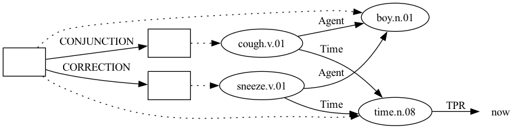


### SVO Sentence

#### Subject Self-repair 
"Josh, no, Mary plays tennis well"

```sbn
entity.n.01
    CORRECTION <1
male.n.02 Name "Josh" EQU -1                  % Josh, 
    CONJUNCTION <2                            % no,
female.n.02 Name "Mary" EQU -2                % Mary
play.v.01 Agent -3 Time +1 Theme +2 Manner +3 % plays
time.n.08 EQU now                             %
tennis.n.01                                   % tennis
well.r.01                                     % well
```

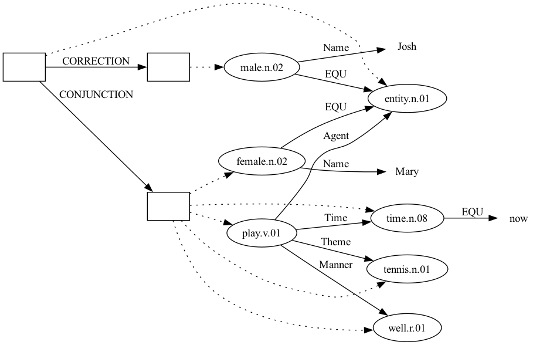

The manner adverb attaches through the `Manner` role, following gold (`p94/d2703`, "I play the piano well."): `play.v.07 Agent -1 Time +1 Theme +2 Manner +3 time.n.08 EQU now piano.n.01 well.r.10`.

This example also illustrates clarification **C5**: the predicate, its tense referent, its object and the adverb all sit inside the `CONJUNCTION` box, not `BOX 0`. However, they will be merged back to the box that `CONJUNCTION` indexes to. 

#### Verb Self-repair
"The cat chases, actually, hunts the rat"

```sbn
cat.n.01                            % The cat
time.n.08 EQU now                   %
    CORRECTION <1                   %
chase.v.01 Agent -2 Time -1         % chases, 
    CONJUNCTION <2                  % actually,
hunt.v.01 Agent -3 Theme +1 Time -2 % hunts
rat.n.01                            % the rat
```

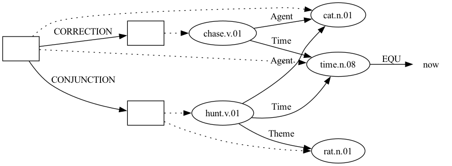

`chase.v.01` carries no `Theme`. This is device ① of the repair toolkit, and it is the correct analysis rather than a concession: the rat was never uttered under the abandoned "chases" plan. PMB gold does the same for arguments that go unrealised: `p62/d1986`, "I also did not call.", is annotated `call.v.03 Agent … Time …` with no recipient, even though `call.v.03` is transitive.


#### Object Self-repair
"I ordered a banana bread, I mean, a cherry pie"

```sbn
person.n.01 EQU speaker              % I
time.n.08 TPR now                    %
order.v.01 Agent -2 Time -1          % ordered
    CORRECTION <1                    %
banana_bread.n.01 ThemeOf -1         % a banana bread,
    CONJUNCTION <2                   % I mean,
cherry_pie.n.01 ThemeOf -2           % a cherry pie
```

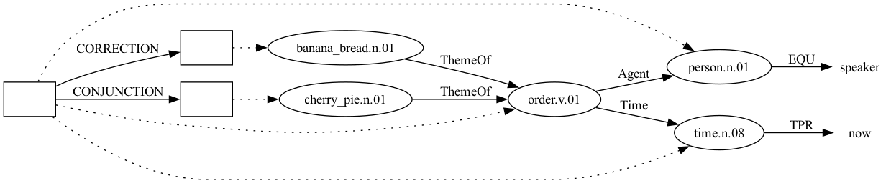

`ThemeOf` here is device ② of the toolkit: the object *is* the reparandum, so it must be linked, and inverting the role lets both candidate objects point backward at `order.v.01` in `Box 0` instead of forcing a positive index down into the `CORRECTION` box.

### Negation
"I didn't order a banana bread, I mean, a cherry pie"

```sbn
person.n.01 EQU speaker              % I
time.n.08 TPR now
    NEGATION <1                      % didn't
order.v.01 Agent -2 Time -1          % order
    CORRECTION <1
banana_bread.n.01 ThemeOf -1         % a banana bread,
    CONJUNCTION <2                   % I mean,
cherry_pie.n.01 ThemeOf -2           % a cherry pie
```

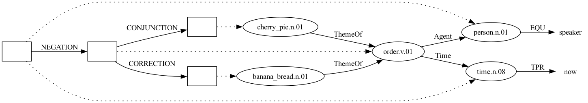

Note the resulting box structure: `BOX0 →NEGATION→ BOX1`, `BOX1 →CORRECTION→ BOX2`, `BOX1 →CONJUNCTION→ BOX3`. Because `CONJUNCTION <2` counts back two boxes from the box it opens, the repair merges into the **negated** box rather than the matrix box, which is what the sentence means. Getting this wrong is easy and produces no parse error.

(`ThemeOf -1` needs the space. `ThemeOf-1` is tokenised as a single unknown token and aborts the parse.)

### Adjunct 
"The class is on Monday, no, on Tuesday"

```sbn
class.n.01                                % The class
time.n.08 EQU now                         %
be.v.01 Theme -2 Time -1                  % is on
    CORRECTION <1                         %
time.n.08 DayOfWeek monday TimeOf -1      % Monday, 
    CONJUNCTION <2                        % no,
time.n.08 DayOfWeek tuesday TimeOf -2     % on Tuesday
```

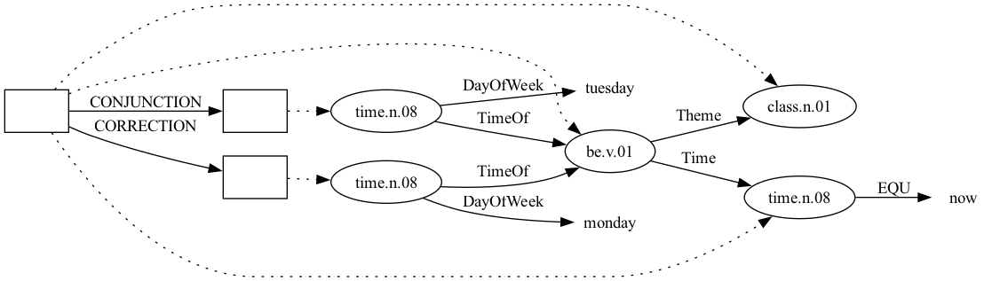

The role is `DayOfWeek`, and its value is a **bare lower-case constant**, not a quoted string. Gold data writes `time.n.08 DayOfWeek monday` (16 occurrences across the weekdays). There is no `Day` role in `SBNSpec.ROLES`, so `Day "Monday"` aborts the parse.

### Preposition replacement
"I ran to, I mean, from the school"

What is repaired here is not a concept but an **edge label** — `Destination` gives way to `Source`. SBN has no way to place a bare role inside a box, so this calls for device ③: introduce a dummy concept, tie it to the event with `EQU`, and hang the competing role on the dummy. Bos (2021) uses the same construction for logical disjunction.

```sbn
person.n.01 EQU speaker              % I
time.n.08 TPR now                    %
run.v.01 Theme -2 Time -1            % ran
school.n.02                          % the school
    CORRECTION <1                    %
entity.n.01 EQU -2 Destination -1    % to, 
    CONJUNCTION <2                   % I mean,
entity.n.01 EQU -3 Source -2         % from
```

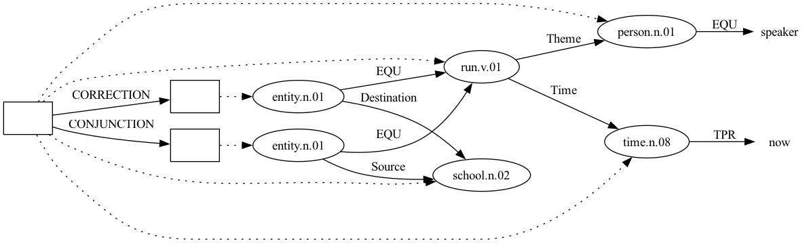

Both dummies are `EQU` to the same running event. Inside the `CORRECTION` box the dummy bears `Destination` and is denied; inside the merged box it bears `Source` and is committed. Every index is negative and every target lies in the superordinate `BOX0`, so no accessibility constraint is touched.

The dummy must be a legal synset: `entity.n.01` is the general-purpose placeholder of the notation and occurs 1315 times in gold, whereas `event.v.01`, being a more intuitive dummy for a predicate, is not a WordNet entry since it has no verbal sense. Following SBN routine, we retain the usage of `entity.n.01`, instead of introducing a new top concept for all activities, e.g., `action.v.01`. 

Note also that PMB never reifies a preposition as its own node in the ordinary case; `Source` and `Destination` attach directly to the verb (`fly.v.01 … Source +2 Destination +3`). The dummy is introduced here *only* because the repair needs two mutually exclusive versions of one edge.

### Universal Quantification - Donkey sentence
"If a farmer owns a donkey, he beats, I mean, feeds it."
Notice the difference with the SBN of verb self-repair. In the current case, the reparandum verb *beat* locates in the consequence (right) clause. It means the reparandum needs to travel across two boxex (`NEGATION` and `CORRECTION`) to reach all the nodes. 

```sbn
    NEGATION <1                          % If
farmer.n.01                              % a farmer
own.v.01 Pivot -1 Theme +1               % owns a
donkey.n.01                              % donkey,
    NEGATION <1
entity.n.01 EQU -1                       % it
    CORRECTION <1
beat.v.01 Agent -4 Patient -1            % he beats, 
    CONJUNCTION <2                       % I mean,
feed.v.01 Agent -5 Patient -2            % he feeds it
```

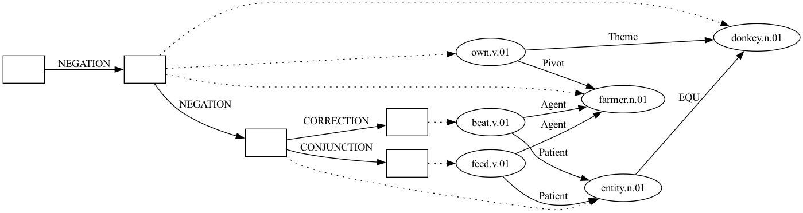

Look at the second `NEGATION`, the one right before `entity.n.01 EQU -1` ("it"). It has to be written `<1`.

SBN builds a universal conditional out of two *nested* negations. It reads as "no donkey-owner who doesn't beat it", being equivalent to "every farmer who owns a donkey beats it." The first `NEGATION <1` opens `BOX1` and targets `BOX0` (`BOX0 →NEGATION→ BOX1`); `BOX1` holds the restrictor, "a farmer owns a donkey." The second `NEGATION` then opens `BOX2`. Writing `<1` counts back one box from `BOX2` and lands on `BOX1`, giving `BOX1 →NEGATION→ BOX2`. That is, `BOX2` sits *inside* `BOX1`, not beside it. That nesting is what makes the two clauses one conditional: `BOX2` (the consequent, "he beats it") falls under the restrictor's own negation, so the whole thing reads roughly as "there is no farmer-and-donkey pair such that he doesn't beat it" — i.e. a universal conditional.

If the second `NEGATION` were written `<2` instead, it would count back two boxes from `BOX2` and land on `BOX0`: `BOX0 →NEGATION→ BOX2`. Now `BOX1` and `BOX2` both hang directly off `BOX0` as siblings, each negated independently (e.g., "no farmer owns a donkey" and, separately, "he doesn't beat it"). There are two unrelated denials instead of one conditional. The parser accepts this without complaint. Nevertheless, it's a different, wrong meaning.

Compared to an ordinary donkey sentence without self-repair, extracted from Bos (2021):
"Every farmer who owns a donkey beats it" 

```sbn
NEGATION -1                     % Every 
farmer.n.01                     % farmer
own.v.01 Pivot -1  Theme +1     % who owns
donkey.n.01                     % a donkey
NEGATION -1                     %
beat.v.01 Agent -3  Patient +1  % beats
entity.n.01 EQU -2              % it
```

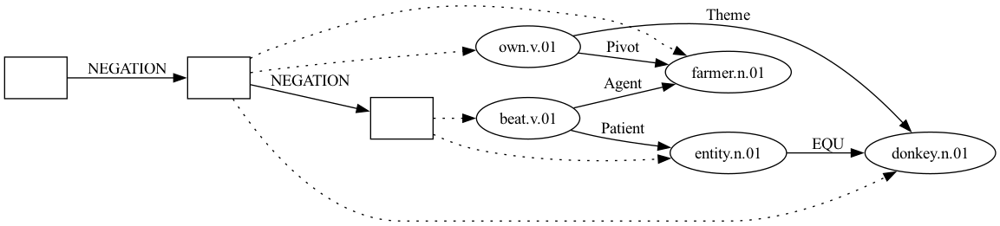

It is noteworthy that in the "ordinary" donkey sentence, the pronoun "it" follows the natural language oder by appearing by the end of the SBN sequence. However, in the sel-repair variety, it is moved forward to satisfy the two rules above. 

### Retracting and Forwarding Repairs

#### Retracting Repair 
"Bill said you will put, I mean, you will drop the ball on the table" (Husband, 2015)

```sbn
male.n.02 Name "Bill"                              % Bill
say.v.01 Proposition >1 Agent -1 Time +1           % said
time.n.08 TPR now
    CONTINUATION <0
person.n.01 EQU hearer                             % you
time.n.08 TSU now                                  % will
    CORRECTION <1
put.v.01 Agent -2 Time -1                          % put, 
    CONJUNCTION <2                                 % I mean,
drop.v.01 Agent -3 Time -2 Theme +1 Destination +2 % you will drop
ball.n.01                                          % the ball
table.n.02                                         % on the table
```

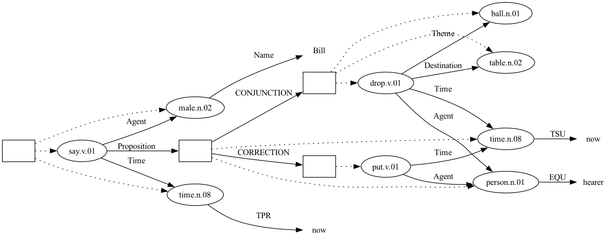

This case demonstrates device ①. Giving `put.v.01` a `Theme +2` and a `Destination +3` reaches forward out of the `CORRECTION` box into a sibling, which breaks the accessibility rules. A more serious issue is the speaker abandoned the utterance after "you will put" and never said what was to be put or where, so assigning it a theme and a destination would be the annotator reconstructing an intention, not transcribing a commitment. Dropping the two roles resolves the accessibility violation and yields the more faithful analysis at the same time.

The forward indices that remain on `drop.v.01` are unproblematic: `drop`, `ball` and `table` all sit in the same `CONJUNCTION` box, so nothing crosses a boundary.

PMB gold shows the same asymmetry between a subordinate and a matrix occurrence of one predicate — `p79/d0205`, "If you sing, we'll sing with you.", has `sing.v.02 Agent -1 Time +1` in the antecedent box against `sing.v.02 Agent -2 Time -1 Co-Agent +1` in the consequent.

#### Forwarding Self-Repair
"Josh drove, no, Marsha drove the old car to the church"

```sbn
entity.n.01
    CORRECTION <1
male.n.02 Name "Josh" EQU -1                         % Josh
time.n.08 TPR now                                    %
drive.v.03 Agent -2 Time -1                          % drove, 
    CONJUNCTION <2                                   % no,
female.n.02 Name "Marsha" EQU -4                     % Marsha
time.n.08 TPR now                                    %
drive.v.03 Agent -2 Time -1 Theme +2 Destination +3  % drove
old.a.02 AttributeOf +1                              % the old
car.n.01                                             % car
church.n.02                                          % to the church
```

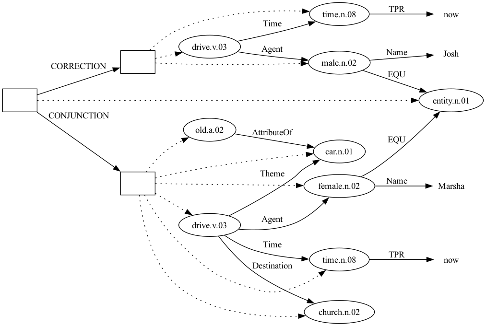

Device ① again: the car and the church were never uttered under the abandoned "Josh drove" plan, so the first `drive.v.03` takes no `Theme` and no `Destination`.

Three more pitfalls worth naming, all of which parse silently with no error:

* A `Theme` on the first `drive.v.03` resolved to the *second* `drive.v.03` (making the event its own theme), and a `Theme` on the second resolved to `old.a.02`, the adjective — both indices landed on whatever concept sat at that raw offset, not on the intended argument.
* Giving the same adjective both a `Value` role and its host concept an `Attribute` role creates two contradictory edges between the same pair of nodes. Gold writes a single inverted edge for an attributive adjective instead: `new.a.01 AttributeOf +1 museum.n.01`.
* `Destination` belongs on the driving event, not on the car. Gold: `go.v.01 … Destination +2 city.n.01`.

## Multiple-Sentence (Discourse) Cases
### Anaphora referring to both reparandum and repair 
"A: My favourite dessert is banana bread, actually, cherry pie. B: They are both good desserts"

```sbn
%%% Utterance 1
person.n.01 EQU speaker                    % A: My
favorite.a.02 Experiencer -1 Stimulus +1   % favourite
dessert.n.01                               % dessert
time.n.08 EQU now                          % 
be.v.02 Theme -2 Time -1                   % is
    CORRECTION <1                          %
banana_bread.n.01 Co-ThemeOf -1            % banana bread, (reparandum)
    CONJUNCTION <2                         % actually,  
cherry_pie.n.01 Co-ThemeOf -2              % cherry pie (repair)
%%% Utterance 2
    CONTINUATION <1                        %
entity.n.01 ANA -2 ANA -1                  % B: They  — picks up both reparandum and repair
time.n.08 EQU now                          % are
be.v.02 Theme -2 Time -1 Co-Theme +2       %
good.a.01 AttributeOf +1                   % both good
dessert.n.01                               % desserts
```

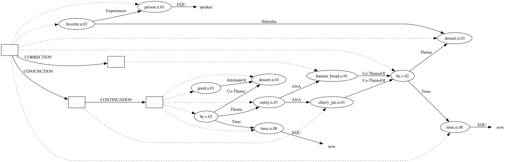

Both candidate objects now reach the copula through `Co-ThemeOf` (device ②), symmetrically.

`Co-ThemeOf` is not part of stock PMB and has to be declared in `sbn_spec.py` in **both** `ROLES` and `INVERTIBLE_ROLES`. Adding it to `ROLES` alone lets the sequence parse but leaves the Penman output as `:Co-ThemeOf`, which Smatch will not normalise against a gold `:Co-Theme`. Cf. **C6**.

The final `dessert.n.01` needs the copula to attach to; without it the concept carries no edges at all and "desserts" contributes nothing to the representation. Gold writes plural predicate nominals this way — "Those are not fish." is `entity.n.01 … be.v.01 Theme -1 Time +1 Co-Theme +2 time.n.08 EQU now fish.n.01`.

This example is the evidence for clarification **C4**: `entity.n.01 ANA -2` reaches into the `CORRECTION` box to pick up the discarded reparandum, and the discourse is entirely natural. To mark "both" explicitly, gold would add `Quantity 2` to the `entity.n.01` ("My parents are both doctors.").

###  Intra-utterance Self-Repair Combined with Cross-turn
"A: Joe bought a Ferrari, I mean, a Jaguar, as a birthday gift. B: No, he bought it as a wedding gift."

```sbn
%%% A's utterance
male.n.02 Name "Joe"                     % Joe
time.n.08 TPR now                        % 
buy.v.01 Agent -2 Time -1 Attribute +3   % bought
    CORRECTION <1                        % [intra-turn: has a sibling CONJUNCTION]
car.n.01 Name "Ferrari" ThemeOf -1       % a Ferrari  (reparandum)
    CONJUNCTION <2                       % I mean, 
car.n.01 Name "Jaguar" ThemeOf -2        % a Jaguar   (merged back into BOX0)
gift.n.01 Of +1                          % as a
birthday.n.01                            % birthday gift
%%% B's utterance
    CORRECTION <1                        % No, [cross-turn: no sibling CONJUNCTION]
male.n.02 EQU -7                         % he
buy.v.01 Agent -1 Theme -4 Attribute +1  % bought it
gift.n.01 Of +1                          % as a
wedding.n.01                             % wedding gift
```

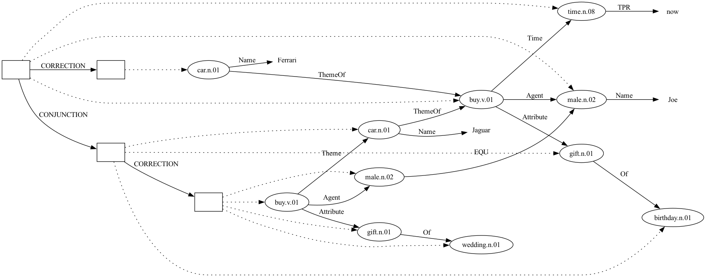

Both uses of `CORRECTION` occur in one sequence, and the structural test of the Mechanism section separates them without any annotation on the token itself: the first has a sibling `CONJUNCTION` and therefore quarantines a reparandum; the second has none and is the Lascarides & Asher relation proper.

The second one is written `<1`, which yields `BOX2 →CORRECTION→ BOX3`. Its target ($\pi_1$ in Lascarides & Asher's terms) is A's `CONJUNCTION` box — the box that, per **C5**, holds `gift.n.01 Of birthday.n.01`, which is exactly what B objects to. As **C5** already established, this `CONJUNCTION` box has no content of its own. Everything in it is merged into whatever box it targets, so "targeting A's `CONJUNCTION` box" means the denial reaches that merged content. Writing `<3` would instead target `BOX0` and deny A's utterance wholesale. Both parse, and after the merge the two readings share the same meaning but are different graphs, scored differently by Smatch; `<1` is the choice made here, because it localises the denial to the constituent under dispute. As with **C6**, this construction has no PMB precedent (it does not occur in gold), so it is a project-internal stipulation rather than received annotation practice — fixed for the same reason **C5** is fixed: leaving it open would let two annotators produce differently-scored graphs for the same discourse.

# Noted Limitations

## Tense and Aspect 
"She went to, well, has been to the church"

Reason:

## Rhetorical Relation Replacement 
"I helped my mum when, I mean, even though I was busy"

Reason:

## Quantifier Replacement
"Every, no, some dishes are tasty"

Reason:

## Modal Verb
"I think you would, well, should work harder"

Reason:

## Discontinuous (Delayed) Repair
"I bought three apples from Lidl yesterday, actually, four"

Every case covered so far is an *instant* repair: the interregnum follows its reparandum immediately, so `CORRECTION` opens right where the trouble source ends. Here the reparandum is just `Quantity 3` on `apple.n.01` — device-wise no different from the Adjunct case's `DayOfWeek monday → tuesday` — but "actually, four" arrives only after "from Lidl yesterday" has already been uttered and committed, and that material is not itself being repaired.

`CORRECTION` can only quarantine what comes after it in the sequence. Opened where "actually" actually occurs, it can no longer reach back and quarantine "three". It is already asserted. Opened right after "three" instead (mimicking the instant-repair cases), it quarantines "from Lidl" and "yesterday" along with it, wrongly marking them as retracted. Device ④ does not rescue this either: it would have to postpone an entire adjunct span past the whole `CORRECTION`/`CONJUNCTION` pair, not just move one argument's index, which is a far larger break from surface order than anything the toolkit currently licenses.